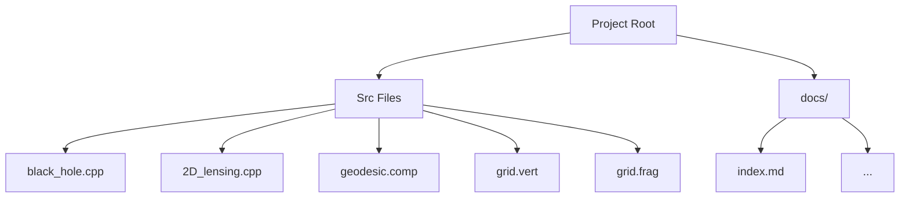
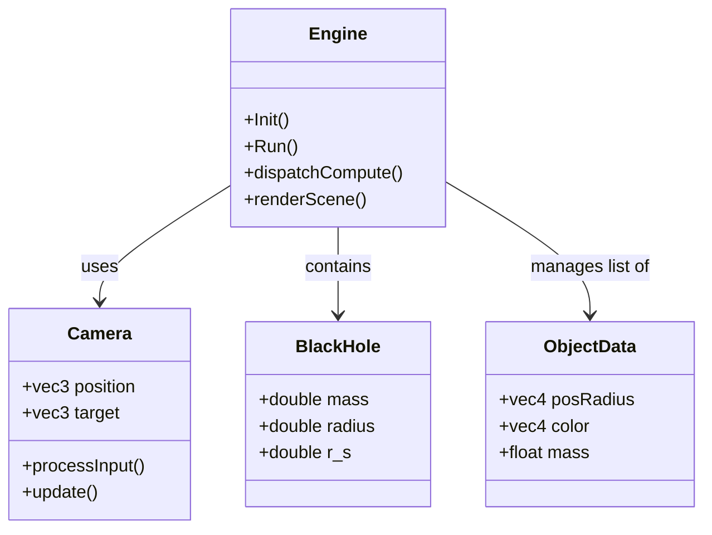

# Code Structure

## Directory Layout

## Key Files

| File | Description |
| :--- | :--- |
| `black_hole.cpp` | **Main Entry Point**. Sets up OpenGL window, Camera, and dispatches compute shaders. |
| `geodesic.comp` | **Compute Shader**. Performs the relativistic ray tracing on the GPU. |
| `2D_lensing.cpp` | **2D Demo**. Standalone CPU-based visualizer for light paths. |
| `grid.vert/frag` | **Visualization**. Shaders for rendering the warped spacetime grid. |

## Class/Struct Overview (`black_hole.cpp`)

## Data Flow
1. **CPU**: `Engine` updates `Camera` and `Object` positions.
2. **Transfer**: Data is uploaded to GPU `UBOs`.
3. **GPU**: `geodesic.comp` reads UBOs, traces rays, writes to `Texture`.
4. **Display**: `Engine` renders a full-screen quad using the generated `Texture`.
